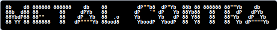
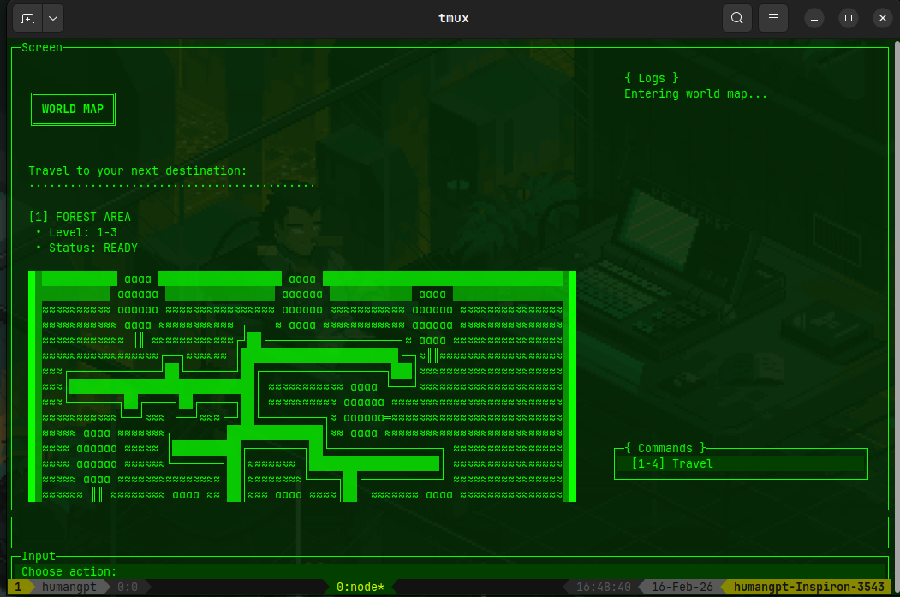

## Metal Contra Clone - Terminal Horizontal Shooter
A work-in-progress horizontal scrolling shooter game inspired by the classic Contra series, built for the terminal with JavaScript.

#### About The Project
This is a terminal-based horizontal shooter currently under development. The game features side-scrolling action rendered entirely in the terminal, where players navigate through levels, shoot enemies, and avoid obstacles. Think classic run-and-gun gameplay meets ASCII art!

# Current Status: 🚧 Under Construction
The combat logic is currently being implemented. Core movement and scrolling mechanics are in place, with combat systems actively being developed.

